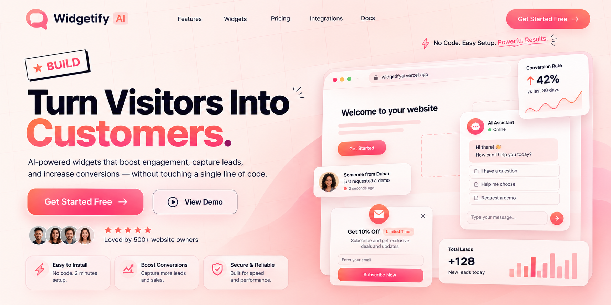
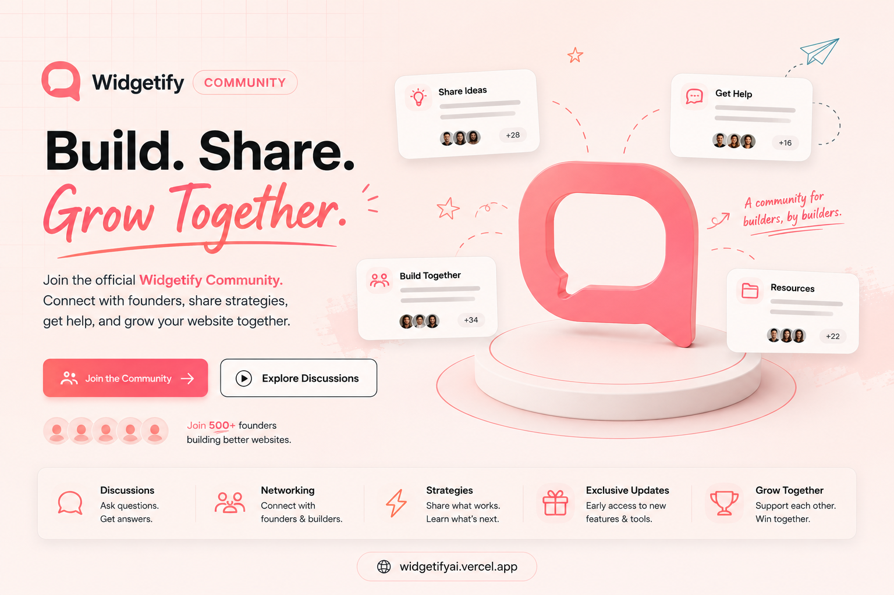

  

# Build Better Websites with Widgetify

We believe every website deserves to convert visitors into customers.

Widgetify helps businesses add beautiful, conversion-focused widgets to their websites without the complexity. Whether you're a startup, freelancer, agency, or business owner, our mission is simple:

**Make powerful website tools accessible to everyone.**

## What We Build

- AI-powered website widgets
- Lead generation tools
- Smart popups and banners
- Conversion optimization
- No-code integrations
- Fast, lightweight, and developer-friendly solutions

## Our Mission

We're a small team building something we genuinely believe can help thousands of businesses grow online.

Every feature, every update, and every late night is driven by one goal:

> **Helping creators and businesses turn more visitors into customers.**

------------------------------------------------------------------------------
## Community

 

-------------------------------------------------------------------------------

## Support Our Journey

Building great products takes time, passion, and community support.

If Widgetify has helped you, inspired you, or if you simply believe in what we're building, please consider supporting us by subscribing.

Your subscription isn't just another payment.

It helps us:
- Ship new features faster
- Keep improving the platform
- Support free users
- Build more AI-powered tools for everyone

Every subscription gives us another reason to keep building.

**Support us today and become part of our journey.**

**Start here:** https://widgetifyai.vercel.app/

Thank you for believing in independent builders.

Together, let's build a better web.
